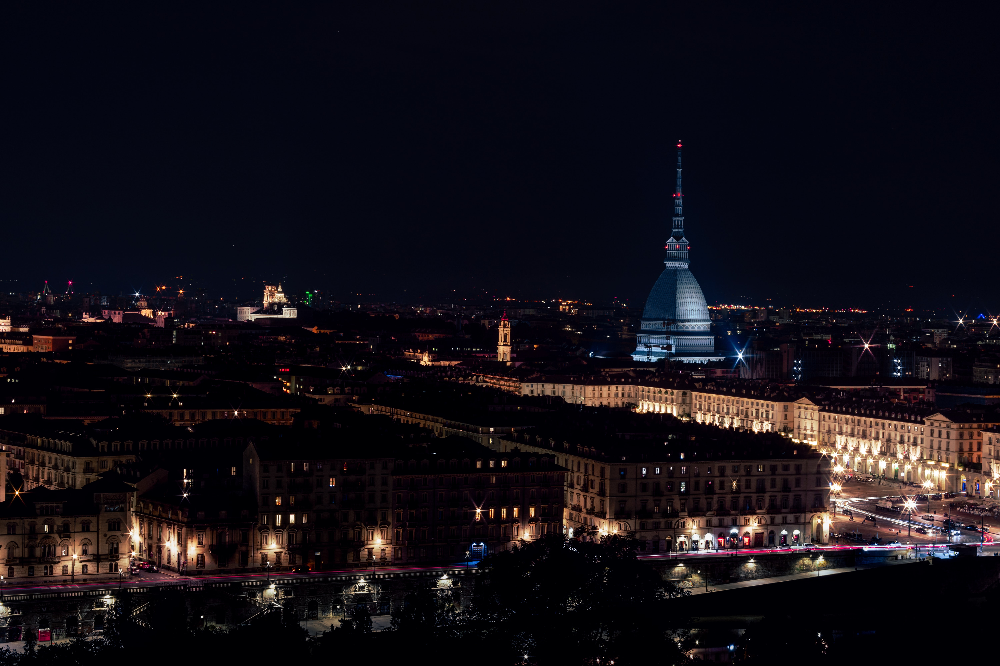

# Capstone Project - The Battle of Neighborhoods (Week 1)

## Introduction & Business Problem

### Questions:

1) How many of you know Turin?

2) How many of you would choose Turin as the travel destination during the next holidays?

### The objective of this assignment:

Increase the international turism of this marvelous city and make easier exploring it. 

Looking at the statistics, Italy is the fifth most visited country in international turism in 2018. In 2017, the overall had 420.63 million visitor nights, of which 210.66 million were of foreign guests (50.08%) (font: https://en.wikipedia.org/wiki/Tourism_in_Italy). But only 1.8 million foreign visitors (out of a total of 7.0 million visitors) visited Turin. in fact, as shown in the table, it is in 13th place!

<details>
  <summary>👀 Espandi codice </summary>

```python
#import all library
import numpy as np # library to handle data in a vectorized manner
import pandas as pd # library for data analsysis
#!pip install bs4
import requests #library for requests
from bs4 import BeautifulSoup
#image libraries
import matplotlib.pyplot as plt
from PIL import Image
from pylab import *
import requests

Torino_text = requests.get('https://en.wikipedia.org/wiki/Tourism_in_Italy').text
soup = BeautifulSoup(Torino_text)
table = soup.find('table',{'class':'wikitable sortable'})

#Extracting the data and cleaning data
table_rows = table.find_all('tr')

data = []
for row in table_rows:
    data.append([t.text.strip() for t in row.find_all('td')]) #clean data
    
del data[0] #delete first element of the table

column_names=['Rank','City','# of nights in 2017', '# of whom foreign visitors','Region']
df = pd.DataFrame(data, columns=column_names) #create Dataframe

df.head(15)
```

</details>

<table border="1" class="dataframe">
  <thead>
    <tr style="text-align: right;">
      <th></th>
      <th>Rank</th>
      <th>City</th>
      <th># of nights in 2017</th>
      <th># of whom foreign visitors</th>
      <th>Region</th>
    </tr>
  </thead>
  <tbody>
    <tr>
      <th>0</th>
      <td>1</td>
      <td>Venice</td>
      <td>37,042,454</td>
      <td>27,477,075</td>
      <td>Veneto</td>
    </tr>
    <tr>
      <th>1</th>
      <td>2</td>
      <td>Bolzano/Bozen</td>
      <td>32,400,662</td>
      <td>22,125,350</td>
      <td>Trentino-Alto Adige/Südtirol</td>
    </tr>
    <tr>
      <th>2</th>
      <td>3</td>
      <td>Rome</td>
      <td>29,833,225</td>
      <td>7,046,098</td>
      <td>Lazio</td>
    </tr>
    <tr>
      <th>3</th>
      <td>4</td>
      <td>Trento</td>
      <td>17,776,030</td>
      <td>7,412,103</td>
      <td>Trentino-Alto Adige/Südtirol</td>
    </tr>
    <tr>
      <th>4</th>
      <td>5</td>
      <td>Verona</td>
      <td>17,293,792</td>
      <td>13,388,082</td>
      <td>Veneto</td>
    </tr>
    <tr>
      <th>5</th>
      <td>6</td>
      <td>Rimini</td>
      <td>15,967,490</td>
      <td>3,808,354</td>
      <td>Emilia-Romagna</td>
    </tr>
    <tr>
      <th>6</th>
      <td>7</td>
      <td>Milan</td>
      <td>15,468,199</td>
      <td>9,291,198</td>
      <td>Lombardy</td>
    </tr>
    <tr>
      <th>7</th>
      <td>8</td>
      <td>Florence</td>
      <td>14,716,466</td>
      <td>10,780,968</td>
      <td>Tuscany</td>
    </tr>
    <tr>
      <th>8</th>
      <td>9</td>
      <td>Naples</td>
      <td>13,161,395</td>
      <td>7,247,964</td>
      <td>Campania</td>
    </tr>
    <tr>
      <th>9</th>
      <td>10</td>
      <td>Brescia</td>
      <td>10,463,688</td>
      <td>7,472,887</td>
      <td>Lombardy</td>
    </tr>
    <tr>
      <th>10</th>
      <td>11</td>
      <td>Livorno</td>
      <td>8,663,572</td>
      <td>3,491,172</td>
      <td>Tuscany</td>
    </tr>
    <tr>
      <th>11</th>
      <td>12</td>
      <td>Sassari</td>
      <td>7,492,538</td>
      <td>4,162,225</td>
      <td>Sardinia</td>
    </tr>
    <tr>
      <th>12</th>
      <td>13</td>
      <td>Turin</td>
      <td>7,046,219</td>
      <td>1,842,052</td>
      <td>Piedmont</td>
    </tr>
    <tr>
      <th>13</th>
      <td>14</td>
      <td>Ravenna</td>
      <td>6,698,702</td>
      <td>1,381,666</td>
      <td>Emilia-Romagna</td>
    </tr>
    <tr>
      <th>14</th>
      <td>15</td>
      <td>Salerno</td>
      <td>6,029,649</td>
      <td>2,098,781</td>
      <td>Campania</td>
    </tr>
  </tbody>
</table>
If you are interest to visit this city, continue to read this notebook and enjoy yourself to find more about it!

Here I leave you some useful links:

1. https://www.turismotorino.org/en

2. https://www.lonelyplanet.com/italy/liguria-piedmont-and-valle-daosta/turin

### About the city:

<details>
  <summary>👀 Espandi codice </summary>

```python
#show the output

import matplotlib.pyplot as plt
from PIL import Image
from pylab import *

img1 = np.array(Image.open('samuele-giglio-_PuPe2QmsEc-unsplash.jpg'))
fig = plt.figure()
plt.imshow(img1, interpolation='bilinear')
fig.set_figwidth(10)
fig.set_figheight(14)
plt.axis('off')
plt.show()

print('The photo is take from: https://unsplash.com/photos/_PuPe2QmsEc')
```
</details>




    The photo is take from: https://unsplash.com/photos/_PuPe2QmsEc


`Turin` (/tjʊəˈrɪn, ˈtjʊərɪn/ tewr-IN, TEWR-in, Piedmontese: `[tyˈriŋ]` (About this soundlisten); Italian: Torino `[toˈriːno]`(About this soundlisten); Latin: Augusta Taurinorum, then Taurinum) is a city and an important business and cultural centre in northern Italy. It is the capital city of Piedmont and of the Metropolitan City of Turin, and was the first Italian capital from 1861 to 1865. The city is located mainly on the western bank of the Po River, in front of Susa Valley, and is surrounded by the western Alpine arch and Superga Hill. The population of the city proper is 875,698 (31 December 2018) while the population of the urban area is estimated by Eurostat to be 1.7 million inhabitants. The Turin metropolitan area is estimated by the OECD to have a population of 2.2 million.

Turin is sometimes called "the cradle of Italian liberty" for having been the birthplace and home of notable individuals who contributed to the Risorgimento, such as Cavour. Even though much of its political significance and importance had been lost by World War II, Turin became a major European crossroad for industry, commerce and trade, and is part of the famous "industrial triangle" along with Milan and Genoa. Turin is ranked third in Italy, after Milan and Rome, for economic strength. With a GDP of $58 billion, Turin is the world's 78th richest city by purchasing power. As of 2018, the city has been ranked by GaWC as a Gamma World city. Turin is also home to much of the Italian automotive industry, with the headquarters of Fiat, Lancia and Alfa Romeo.

The city has a rich culture and history, being known for its numerous art galleries, restaurants, churches, palaces, opera houses, piazzas, parks, gardens, theatres, libraries, museums and other venues. Turin is well known for its Renaissance, Baroque, Rococo, Neo-classical, and Art Nouveau architecture.

In addition, the city is home to museums such as Museo Egizio, Mole Antonelliana and Museo Nazionale del Cinema. The city also hosts some of Italy's best universities, colleges, academies, lycea and gymnasia, such as the University of Turin, founded in the 15th century, and the Turin Polytechnic. Turin is well known as the home of the Shroud of Turin, the football teams Juventus F.C. and Torino F.C., and as host of the 2006 Winter Olympics (font: https://en.wikipedia.org/wiki/Turin)
